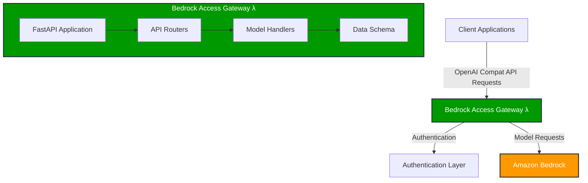
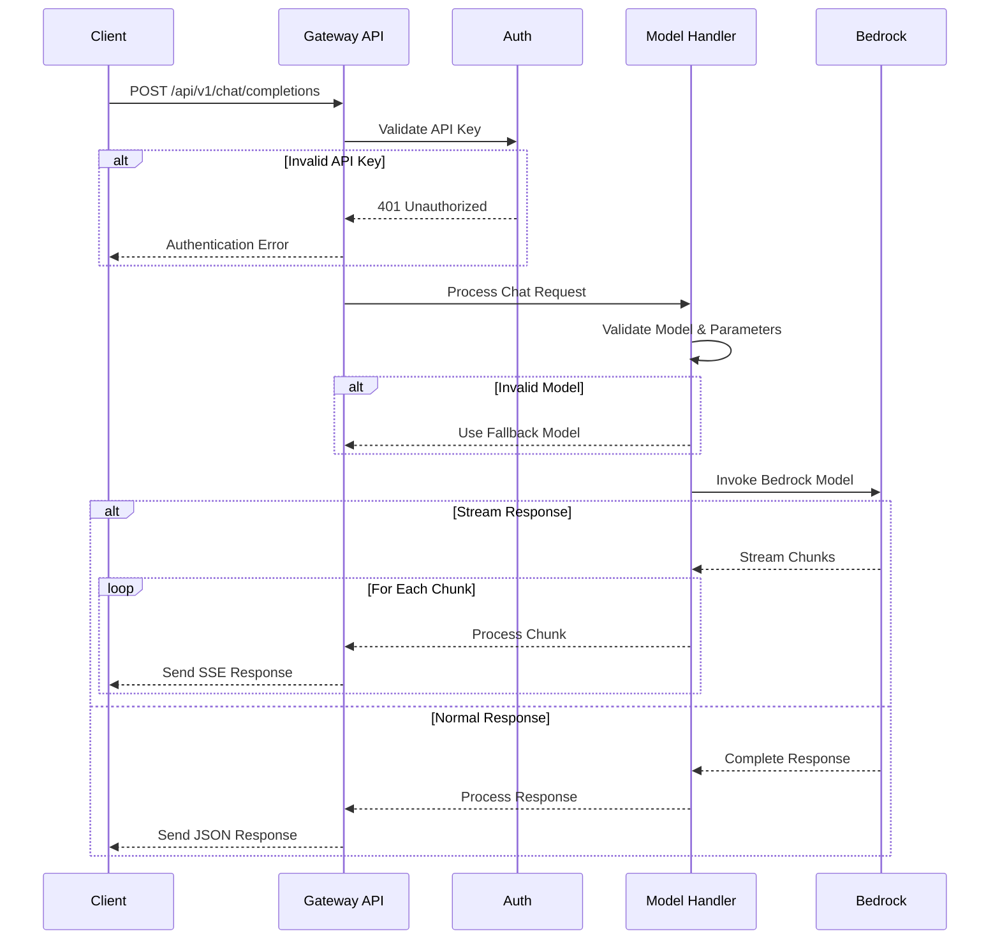
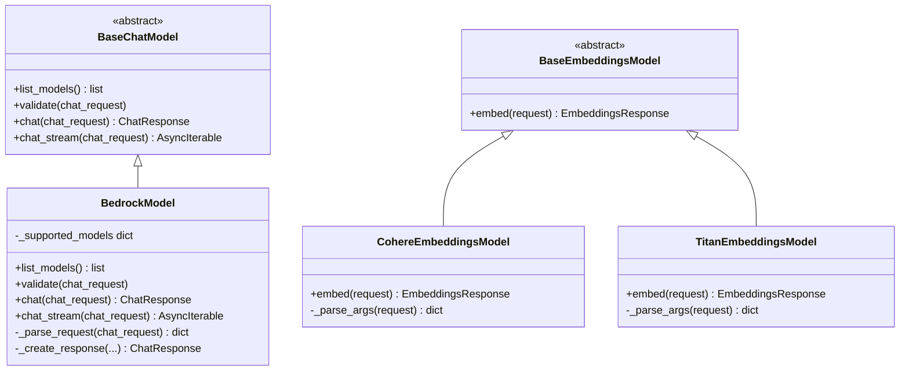
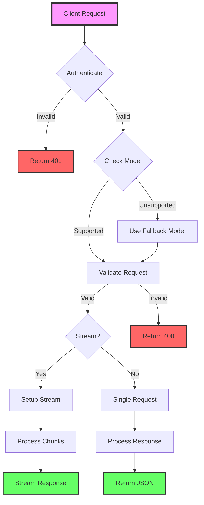
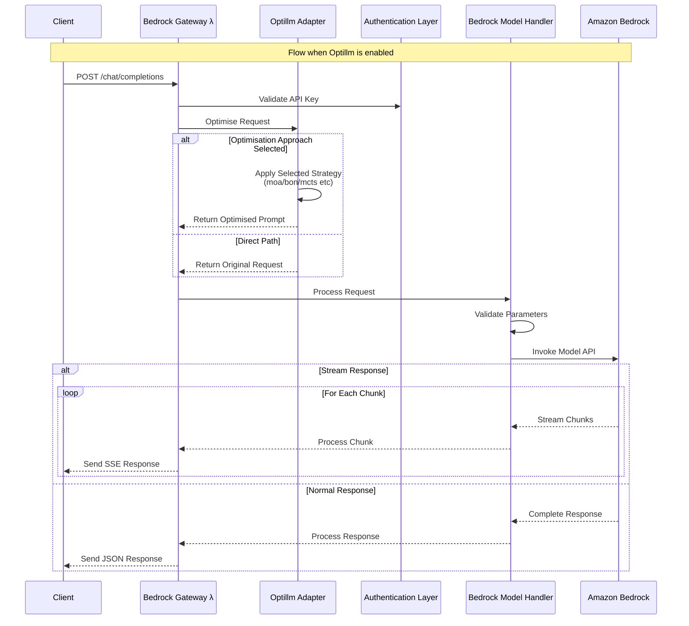
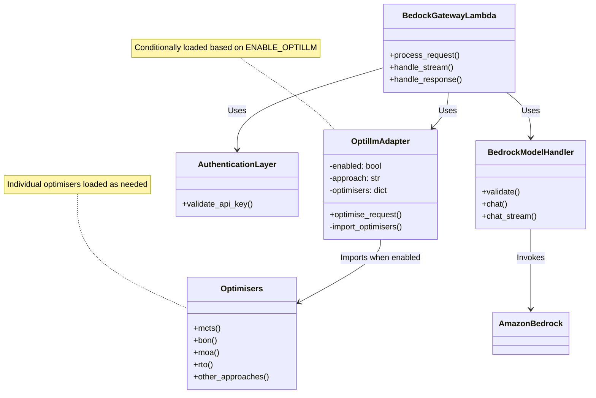
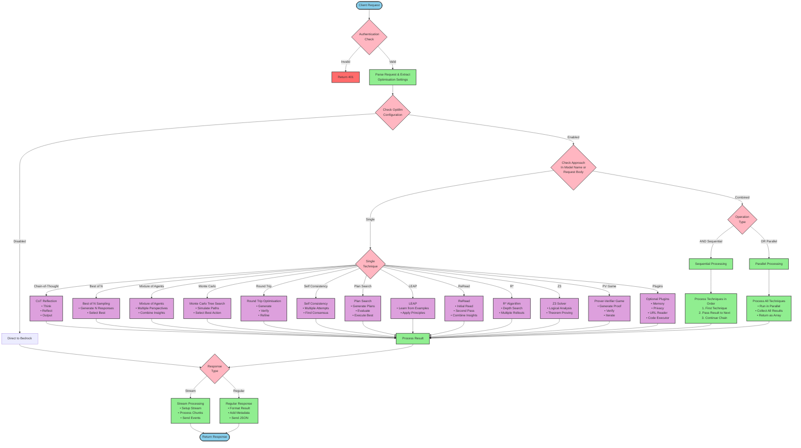

# OpenAI Compatible API for Amazon Bedrock

This lambda provides an OpenAI compatible API for Amazon Bedrock. It uses the Amazon Bedrock API and libraries and exposes an API that is compatible with OpenAI's which is what most tools have standardised on now.

- [OpenAI Compatible API for Amazon Bedrock](#openai-compatible-api-for-amazon-bedrock)
  - [Building Locally](#building-locally)
  - [Diagrams](#diagrams)
  - [Future Improvements](#future-improvements)
    - [OptiLLM Integration](#optillm-integration)

It was originally based off of an official AWS Example then rewritten with a number of improvements:

- Asynchronous handling of requests.
- Support for newer models.
- Support for a fallback model when the primary model is not available.
- Improved error handling.
- Improved logging.
- Improved performance with larger requests.
- Improved prompting flexibility.
- **Currently in BETA**: Support for Optillm to perform optimisation of prompts and automated prompting techniques.

## Building Locally

You can build the Docker image locally and run it with the following command:

```bash
docker build -t bedrock-gateway .
docker run -e AWS_SECRET_ACCESS_KEY=$AWS_SECRET_ACCESS_KEY -e AWS_SESSION_TOKEN=$AWS_SESSION_TOKEN -e AWS_ACCESS_KEY_ID=$AWS_ACCESS_KEY_ID -p 9000:8080 -it bedrock-gateway

# Test the lambda invokes (won't submit a request to bedrock)
curl -XPOST "http://localhost:9000/2015-03-31/functions/function/invocations" -d "{"""msg""":"""hello"""}"
```

## Diagrams

Component Diagram



Sequence chart



Class diagram



Process flow



## Future Improvements

### OptiLLM Integration

Not yet implemented, but the plan is to integrate OptiLLM for optimisation of requests.

It might look something like:






